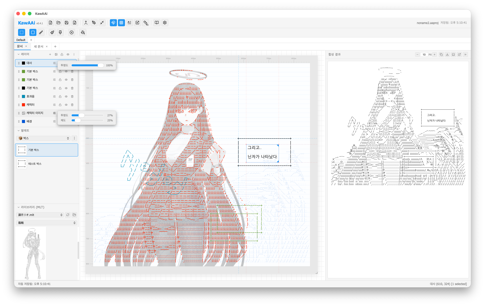
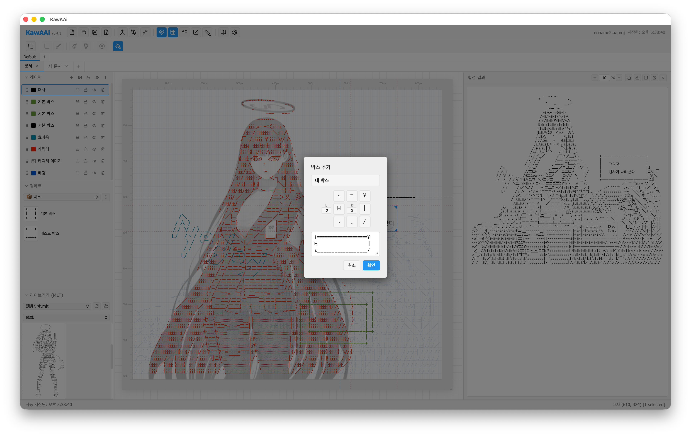
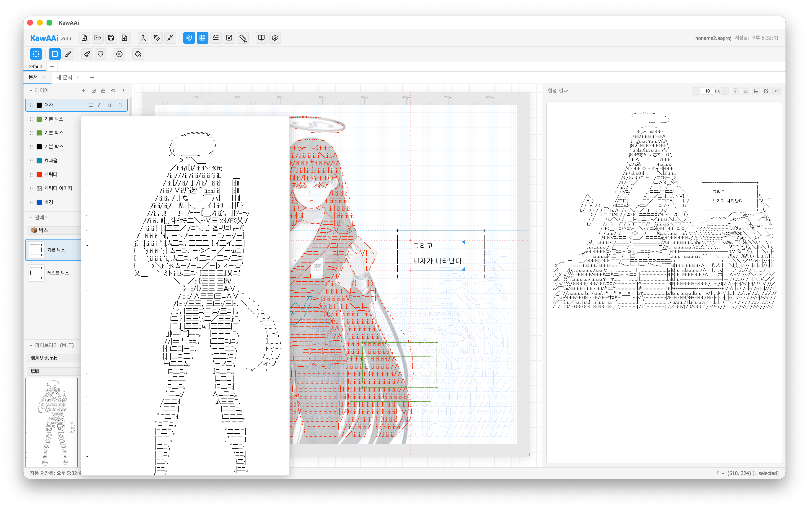
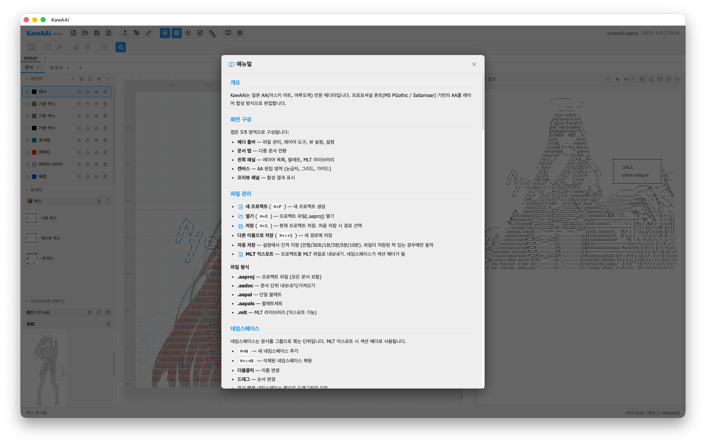

# KawAAi

일본 AA(아스키 아트, 야루오계) 전문 에디터.

프로포셔널 폰트(MS PGothic / Saitamaar) 기반의 AA를 레이어 합성 방식으로 편집하는 데스크탑 앱입니다.

## 스크린샷









## 주요 기능

### 레이어 기반 편집
- 텍스트/이미지 레이어를 자유롭게 배치, 이동, 크기 조절
- 레이어 순서 변경 (드래그), 잠금, 가시성 토글
- 다중 선택 (Ctrl/Shift+클릭) → 복사, 붙여넣기, 병합
- 레이어별 텍스트 색상, 투명도 설정

### 합성 엔진
- 모든 레이어를 픽셀 좌표 기준으로 합성
- 공백 = 투명, 비공백 = 불투명 (상위 레이어 우선)
- 빈 구간은 유니코드 스페이스 조합으로 정밀하게 채움

### 블록 편집
- 하단 툴바에서 블록 편집 모드 활성화
- 사각 선택 / 브러시 선택으로 문자 단위 영역 선택
- 선택 영역에 공백 채색 적용/제거
- Shift+드래그로 추가 선택, Ctrl+Shift+드래그로 제거
- 박스 자동 채색 토글 (박스 생성 시 자동 불투명 처리)

### 박스 생성
- 팔레트의 박스 프리셋 클릭으로 활성화
- 캔버스에서 드래그하여 박스 텍스트 레이어 생성
- 8개 캐릭터(4모서리 + 4변) + 좌/우 패딩 보정
- 드래그 중 실시간 미리보기, Escape로 취소
- Ctrl+Z로 되돌리기

### 도트 문자 입력
- Shift+스페이스바를 누를 때마다 좁은 공백 → 넓은 공백으로 순환 교체
- AA에서 미세 간격 조정에 필수

### 레이어 속성
- 레이어별 투명도 조절 (텍스트/이미지)
- 이미지 레이어 채도 조절

### 네임스페이스
- 문서를 그룹으로 관리하는 네임스페이스
- MLT 익스포트 시 섹션 헤더로 사용
- 추가/삭제/이름 변경/드래그 순서 변경
- 문서를 다른 네임스페이스로 드래그 이동
- 삭제된 네임스페이스 복원 (Ctrl+Shift+N)

### 다중 문서
- 탭 기반 다중 문서 편집
- 문서 복사/붙여넣기, 이름 변경, 드래그 순서 변경
- 닫힌 문서 복원 (Ctrl+Shift+T)

### 팔레트
- 캐릭터 팔레트: AA 문자 등록, 더블클릭으로 삽입
- 박스 팔레트: 박스 프리셋 등록, 클릭으로 활성화 후 캔버스 드래그 생성
- 드롭다운으로 캐릭터/박스 팔레트 전환
- 다중 선택 (Ctrl/Shift+클릭)으로 일괄 삭제
- 팔레트/팔레트세트 임포트/익스포트 (.aapal / .aapals)

### MLT 라이브러리 / 익스포트
- MLT 파일 디렉토리를 지정하여 AA 라이브러리 탐색
- 파일 내 섹션 헤더 자동 인식, 섹션 드롭다운으로 탐색
- AA 항목 마우스 오버 시 큰 프리뷰 팝업
- AA 항목 클릭으로 레이어에 삽입
- 프로젝트를 MLT 파일로 익스포트 (네임스페이스 → 섹션 헤더)

### 레이어 캔버스 (간이 편집)
- 이미지를 참고하면서 AA 작성
- 크기/투명도 조절, 글씨색 설정
- 완성 후 레이어로 삽입

### 캔버스 설정
- 문서별 캔버스 크기(가용영역), 폰트 크기, 행간 설정
- 캔버스 크기 잠금 (드래그 리사이즈 비활성화)
- 디스플레이 해상도 프리셋 (모바일/태블릿/데스크탑)
- 행간 비율 잠금/해제 (폰트 크기 연동 또는 독립 조정)
- 눈금자 단위 전환 (px/mm)
- 커스텀 가이드 선 (룰러에서 드래그로 생성, 이동, 제거)

### 합성 결과
- 실시간 합성 미리보기
- 클립보드 복사, .txt 내보내기
- 패널 위치 전환 (우측/하단/별도 창)
- 프리뷰 폰트 크기 조절 (캔버스 행간 비율 반영)

### 기타
- 다국어 지원 (한국어, 日本語, English)
- 라이트/다크 테마 (시스템 설정 연동)
- 자동 저장 (30초~10분 간격 설정)
- 스냅 그리드, 눈금자 (px/mm), 레이어 가이드, 커스텀 가이드 선
- 문자 그리드 시각화
- 되돌리기/다시 실행 (Ctrl+Z / Ctrl+Shift+Z)
- 윈도우 위치/크기, 패널 너비 자동 저장/복원
- 패널 섹션 접기/열기 상태, 팔레트/MLT 선택 상태 저장

## 단축키

| 단축키 | 기능 |
|--------|------|
| `Ctrl+N` | 새 네임스페이스 |
| `Ctrl+Shift+N` | 삭제된 네임스페이스 복원 |
| `Ctrl+T` | 새 문서 |
| `Ctrl+W` | 문서 닫기 |
| `Ctrl+Shift+T` | 삭제된 문서 복원 |
| `Ctrl+P` | 새 프로젝트 |
| `Ctrl+O` | 열기 |
| `Ctrl+S` | 저장 |
| `Ctrl+Shift+S` | 다른 이름으로 저장 |
| `Ctrl+Z` | 되돌리기 |
| `Ctrl+Shift+Z` / `Ctrl+Y` | 다시 실행 |
| `Ctrl+C` / `Ctrl+V` | 레이어 복사/붙여넣기 |
| `Delete` / `Backspace` | 선택된 레이어 삭제 |
| `Escape` | 박스/팔레트 해제 → 블록 선택 해제 → 모드 해제 → 레이어 선택 해제 |
| `Shift+Space` | 도트 문자 순환 입력 |

> macOS에서는 Ctrl 대신 ⌘(Cmd) 키를 사용합니다.

## 파일 형식

| 확장자 | 설명 |
|--------|------|
| `.aaproj` | 프로젝트 파일 (모든 문서 포함) |
| `.aadoc` | 문서 단위 내보내기/가져오기 |
| `.aapal` | 단일 팔레트 |
| `.aapals` | 팔레트세트 |
| `.mlt` | MLT 라이브러리 (읽기 + 익스포트) |

## 설치

[Releases](https://github.com/tunaground/KawAAi/releases) 페이지에서 최신 버전을 다운로드하세요.

| 플랫폼 | 파일 |
|--------|------|
| macOS (Apple Silicon) | `KawAAi_x.x.x_aarch64.dmg` |
| macOS (Intel) | `KawAAi_x.x.x_x64.dmg` |
| Windows | `KawAAi_x.x.x_x64.msi` |

### macOS
1. `.dmg` 파일을 열고 KawAAi를 Applications 폴더에 드래그
2. 처음 실행 시 "확인되지 않은 개발자" 경고가 뜨면: 시스템 설정 → 개인정보 보호 및 보안 → "확인 없이 열기" 클릭

### Windows
1. `.msi` 파일 실행
2. 설치 마법사 안내를 따라 설치

## 기술 스택

- [Tauri v2](https://tauri.app/) — 데스크탑 앱
- [React](https://react.dev/) + [TypeScript](https://www.typescriptlang.org/)
- [Vite](https://vite.dev/) — 번들러
- [Zustand](https://zustand-demo.pmnd.rs/) — 상태 관리
- [Lucide](https://lucide.dev/) — 아이콘

## 개발

```bash
# 의존성 설치
npm install

# 개발 서버 (Tauri 앱)
npm run tauri dev

# 프론트엔드만 (브라우저)
npm run dev

# 타입 체크
npx tsc --noEmit

# 프로덕션 빌드
npm run tauri build
```

## 라이선스

[MIT License](LICENSE)
